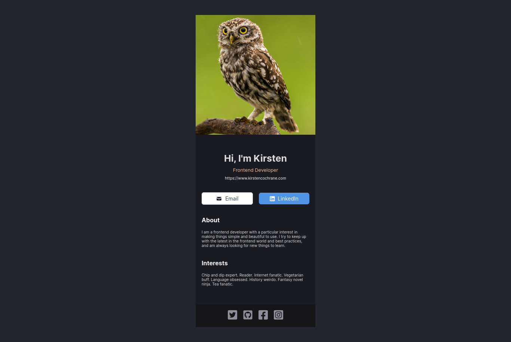

# React Solo Project - Digital Business Card

This is the first Solo project on the Scrimba React course [Scrimba React Course - Free](https://v2.scrimba.com/learn-react-c0e). In the first module, introduced to the basics of:

- Making custom components.
- Styling.
- Static React sites.
- Using JSX.

This project is a check-point for those basics.

Live Link - https://digital-card-react-nine.vercel.app/
 
Github Repo - https://github.com/ofthewildfire/digital-card-react-project

## Final summary of what was learned in React Basics Part 1!

In this first portion of the React Basics I learned what JSX was.

- JSX is just a syntax that React uses. It is very similar to HTML. However there are some changes. Namely, when you need to add a class to an element, unlike HTML, in JSX this is camelCased and there are other small changes depending on the attribute. For example, adding a classname - in JSX this is `className`.
  I learned how to make a custom component in React.
- This is achieved by created a function/or if you want to use the training wheels a variable that holds some html looking elements, but, they are actually JSX because in order to use React, you'll have to import the React "code" through the `import React from "react"` - after you install it via a dependency with npm, or, if you are using a CDN. <b> This is needed or its just plain HTML! </b>!
  I also learned the best practices on how to make a component in a new file and import it, so that React is modular and composable.

I was able to get reaquainted with the ES6 import/export. Which was great.

I now know how to make some simple static sites with React. <3

## Changes

This being a solo project as a checkpoint to make sure you're learning. I haven't put as much effort into the organization of the CSS as I could, I plan to return to this in a few days/or when I have some spare time and make it much neater.

I also want to get back to the project and add a toggle to the light mode too! Because, why not? :) toggles are fun after all.

Good times!
